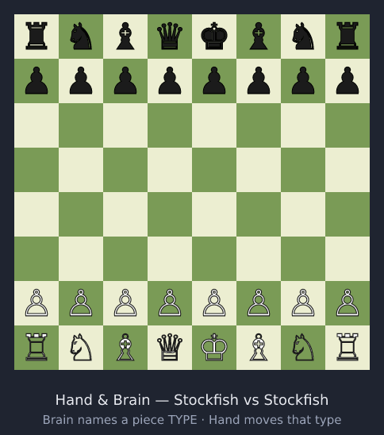

# ♟ Hand & Brain Chess

An interactive implementation of **Hand and Brain**, the team chess variant.

Each side is two players:

- The **Brain** names a *piece type* (pawn, knight, bishop, rook, queen, king).
- The **Hand** must move a piece of that type — choosing *which* one and *where*,
  among all legal moves of that type.

The Brain communicates **only** the piece type. That single-bit-per-turn
constraint is the whole point of the game, and it is preserved everywhere.



*Above: an actual engine game — each move is the Brain naming a piece type and
the Hand then choosing among that type's legal moves, often diverging from the
engine's own top choice. Regenerate with `npm run demo:gif -w @hnb/web`.*

## Status

| Phase | Scope | State |
| ----- | ----- | ----- |
| 0 | Core turn-protocol engine + local hot-seat | ✅ |
| 1 | Stockfish AI: opponent, AI-Brain teammate, AI-Hand teammate | ✅ |
| 2 | Online 2v2 multiplayer with an authoritative server | ✅ |
| 3 | Dual Hand/Brain Elo, rating-aware matchmaking, history, leaderboards | ✅ |
| 3+ | Durable persistence of identities/ratings/history (JSON-file store behind a swappable seam) | ✅ |
| next | Postgres/Prisma store (schema in `docs/data-model.md`), accounts/auth, duo-queue, spectating | planned |

Full chess rules (castling, en passant, promotion, check, checkmate,
stalemate, draws) are correct because rule logic is delegated entirely to
[chess.js](https://github.com/jhlywa/chess.js).

## Playing

**Local** (no server needed): hot-seat for four humans around one device, or
any mix with Stockfish — *You vs AI*, *AI Brain teammate* (it announces a
type, you pick the move — diverging from its idea is the fun), *AI Hand
teammate* (you name types, it moves).

**Online**: play with friends in a **private room** — create one, share the
invite link or 5-letter code, pick seats, and the host starts (the room
survives each game for instant rematches). Or queue as Hand, Brain, or either
and let the server form 2v2 teams of similar strength. Every action is
server-validated; matches run under a **5+3 team clock** (Brain thinking
counts!) with server-side flag detection; draw offers, resignation,
refresh/reconnect handling, and dual Hand/Brain Elo ratings round it out.

## Architecture

> **chess.js is the single source of truth** for move generation, legality, and
> game-over detection. The Hand and Brain logic is a thin, well-tested layer on
> top of it — it never reimplements chess rules. Online, the **server is
> authoritative**: every Brain choice and Hand move is validated server-side;
> the client never applies moves locally.

### The turn protocol

The engine implements exactly this ordering, which makes every edge case fall
out for free:

1. Compute **all legal moves** for the side to move (chess.js).
2. Derive the set of piece types that have ≥ 1 legal move.
3. The **Brain** picks one type from that set (membership is validated).
4. Filter legal moves to that piece type; present them to the Hand.
5. The **Hand** picks one move from the filtered set (validated).
6. Apply the move, switch sides.

Because the offered types are *derived from the legal-move list*:

- **Check** needs no special-casing — types that can't resolve the check simply
  never appear as Brain options.
- **Castling** is a king move, **en passant** and **promotion** are pawn moves
  (promotion additionally lets the Hand choose the promotion piece).
- The Brain can never name a type that has no legal move.

### The seat model

Every game has four seats — a Brain and a Hand per color. Locally each seat is
human- or Stockfish-controlled (all modes are just seat configurations);
online each seat is a connected player.

- **AI Brain** runs a full Stockfish search, then announces only the piece
  *type* of its preferred move — exactly the one bit a human Brain may
  communicate.
- **AI Hand** obeys the named type mechanically: the search is restricted with
  UCI `searchmoves` to the legal moves of that type, so the engine cannot
  "cheat" outside the Brain's instruction.

Stockfish runs in-browser as a single-threaded WASM Web Worker (the
`lite-single` build: ~7&nbsp;MB, no cross-origin-isolation headers needed, far
stronger than any human). Difficulty (1–8) maps to Stockfish's Skill Level
plus a per-move time budget, isolated in one table for retuning. The engine
binary is **not** committed; it is staged from `node_modules` into
`public/engine/` before dev/build.

### Ratings (dual Elo)

Every player has **two independent ratings** — one as Hand, one as Brain
(both seeded at 1200, floored at 100, provisional K=40 for the first 20 games
per role, then K=32). After a game, each player updates *only the role they
played*, against the **opposing team's average relevant rating**, with the
team result. Matchmaking pairs on the same definition: the longest waiter
anchors the match, rating-closest compatible players fill it, and the team
split minimizes the strength gap. All formulas and tunables live in
`packages/core/src/elo.ts`.

### Monorepo layout

```
packages/
  core/      Shared by client and server — they can never drift
    src/HandBrainGame.ts   The turn protocol — the heart of the project
    src/protocol.ts        Wire protocol + inbound message validation
    src/elo.ts             Dual-rating Elo math (isolated + tunable)
  web/       React client (Vite)
    src/ai/                Stockfish WASM worker, UCI helpers, difficulty
    src/game/seats.ts      Local seat model + mode presets
    src/ui/                PlaySurface (shared board UI), panels, local views
    src/online/            WS connection, online state hook, online views
  server/    Authoritative online server (Node + ws)
    src/match.ts           Seat-level authority over one game
    src/matchmaking.ts     Pure queue pairing (rating-aware)
    src/ratings.ts         Rating ledger applying the core Elo rule
    src/lobby.ts           Identities, queue, matches, reconnection (socket-free)
    src/server.ts          Thin ws wiring + static serving of the web build
docs/data-model.md         Persistence schema ahead of the database phase
```

## Getting started

Requires Node 18+.

```bash
npm install
npm run dev          # ▶ play-test: boots BOTH the server and web client
                     #   open http://localhost:5173 (one URL — /ws is proxied)
npm test             # all workspace test suites
npm run build        # typecheck + production build
```

`npm run dev` runs the game server and the Vite client together (labeled
`server`/`web`). Local hot-seat and all three AI modes work immediately; for
online play, open a second browser tab to fill more seats — you can play all
four roles yourself across tabs. To run just one side: `npm run dev:web` or
`npm run dev:server`.

### Play-testing the production build

```bash
npm run build
npm start            # one process serves the web app + WebSocket on $PORT (default 8080)
```

### Deploy (play-test from anywhere, e.g. your phone)

The repo ships a host-agnostic multi-stage `Dockerfile` that builds every
workspace and runs the single-process server (web app + WebSocket on `$PORT`).
It runs on any container host — Fly.io, Render, Railway, Cloud Run, a VPS:

```bash
docker build -t hand-n-brain .
docker run -p 8080:8080 hand-n-brain   # → http://localhost:8080
```

Point a host at this Dockerfile with auto-deploy-on-push and play-testing
becomes part of the cycle: push to the branch → the host rebuilds → open the
URL on any device.

**Render (preconfigured).** `render.yaml` is a Render Blueprint for the
Dockerfile above. One-time setup:

1. Push this repo to GitHub (already done for the feature branch).
2. In the Render dashboard → **New → Blueprint**, connect the repo. Render
   reads `render.yaml` and creates the `hand-n-brain` web service.
3. Pick the branch to track (e.g. `claude/hand-brain-chess-engine-acdtwv`, or
   `main` once merged) and deploy.

Player identities, ratings, and match history are persisted to a JSON file
(`data/hnb.json` by default; set `HNB_DATA_FILE` to relocate, or `""` to
disable) so they survive restarts within an instance. The store is a swappable
seam (`packages/server/src/store.ts`) — the Postgres/Prisma implementation in
`docs/data-model.md` drops in without touching the lobby. For durability across
Render's ephemeral redeploys, point `HNB_DATA_FILE` at a mounted disk.

Render injects `$PORT` and serves WebSockets over the same port, so no extra
configuration is needed. After the first deploy you get an `https://…onrender.com`
URL — open it on your phone, share it to fill the other seats, and every push
to the tracked branch redeploys automatically. (Free instances sleep when
idle; the first hit after a nap has a short cold start.)

## How to play

Pick a mode (or go online) on the setup screen, then on each turn:

1. **Brain:** click one of the offered piece types (or wait for the AI/your
   teammate's announcement).
2. **Hand:** the board highlights every movable piece of that type. Click a
   piece, then a highlighted destination (or drag it, or pick from the move
   list). Promotions prompt for the promotion piece. In local play, *Back to
   Brain* lets a human Brain reconsider; online (and with an AI Brain) the
   announcement is binding.

The banner shows whose turn it is, which role must act, and check / game-over
state. Online you also see the roster with live connection status, your
ratings, rating changes after each game, leaderboards, and recent matches.

## Tech

- **Rules:** [chess.js](https://github.com/jhlywa/chess.js) (authoritative)
- **AI:** [Stockfish.js](https://github.com/nmrugg/stockfish.js) WASM
  (GPLv3, loaded as a separate runtime worker asset, not bundled)
- **UI:** React + TypeScript, [react-chessboard](https://github.com/Clariity/react-chessboard)
- **Server:** Node + TypeScript, [ws](https://github.com/websockets/ws)
- **Build/test:** Vite + Vitest, npm workspaces

## License

[MIT](MIT.md) for this project's code. The Stockfish engine binary is GPLv3
and is fetched from npm at install time rather than committed.
